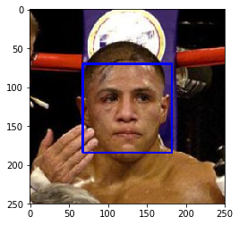
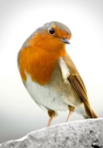
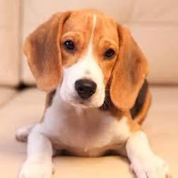
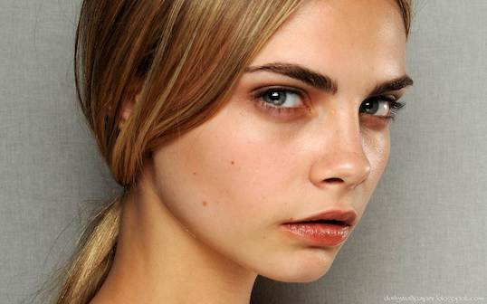
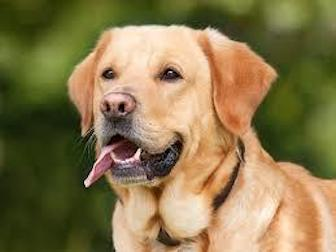
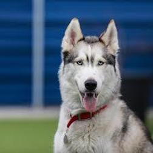
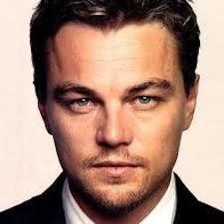
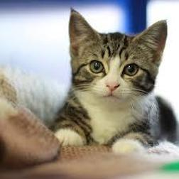

# P2 Dog Breed Classifier

---
By Jen-Feng Hsieh

In this project, we will build a pipeline to process real-world, user-supplied images. Given an image of a dog, the Convolutional Neural Networks algorithm will identify an estimate of the canine’s breed. If supplied an image of a human, the code will identify the resembling dog breed.

### The Road Ahead

We break the notebook into separate steps.  Feel free to use the links below to navigate the notebook.

* [Step 0](#step0): Import Datasets
* [Step 1](#step1): Detect Humans
* [Step 2](#step2): Detect Dogs
* [Step 3](#step3): Create a CNN to Classify Dog Breeds (from Scratch)
* [Step 4](#step4): Use a CNN to Classify Dog Breeds (using Transfer Learning)
* [Step 5](#step5): Create a CNN to Classify Dog Breeds (using Transfer Learning)
* [Step 6](#step6): Write your Algorithm
* [Step 7](#step7): Test Your Algorithm

---
<a id='step0'></a>
## Step 0: Import Datasets

### Import Dog Dataset

In the code cell below, we import a dataset of dog images.  We populate a few variables through the use of the `load_files` function from the scikit-learn library:
- `train_files`, `valid_files`, `test_files` - numpy arrays containing file paths to images
- `train_targets`, `valid_targets`, `test_targets` - numpy arrays containing onehot-encoded classification labels 
- `dog_names` - list of string-valued dog breed names for translating labels


```python
from sklearn.datasets import load_files       
from keras.utils import np_utils
import numpy as np
from glob import glob

# define function to load train, test, and validation datasets
def load_dataset(path):
    data = load_files(path)
    dog_files = np.array(data['filenames'])
    dog_targets = np_utils.to_categorical(np.array(data['target']), 133)
    return dog_files, dog_targets

# load train, test, and validation datasets
train_files, train_targets = load_dataset('dogImages/train')
valid_files, valid_targets = load_dataset('dogImages/valid')
test_files, test_targets = load_dataset('dogImages/test')

# load list of dog names
dog_names = [item[20:-1] for item in sorted(glob("dogImages/train/*/"))]

# print statistics about the dataset
print('There are %d total dog categories.' % len(dog_names))
print('There are %s total dog images.\n' % len(np.hstack([train_files, valid_files, test_files])))
print('There are %d training dog images.' % len(train_files))
print('There are %d validation dog images.' % len(valid_files))
print('There are %d test dog images.'% len(test_files))
```

    Using TensorFlow backend.


    There are 133 total dog categories.
    There are 8351 total dog images.
    
    There are 6680 training dog images.
    There are 835 validation dog images.
    There are 836 test dog images.


### Import Human Dataset

In the code cell below, we import a dataset of human images, where the file paths are stored in the numpy array `human_files`.


```python
import random
random.seed(8675309)

# load filenames in shuffled human dataset
human_files = np.array(glob("lfw/*/*"))
random.shuffle(human_files)

# print statistics about the dataset
print('There are %d total human images.' % len(human_files))
```

    There are 13233 total human images.


---
<a id='step1'></a>
## Step 1: Detect Humans

We use OpenCV's implementation of [Haar feature-based cascade classifiers](http://docs.opencv.org/trunk/d7/d8b/tutorial_py_face_detection.html) to detect human faces in images.  OpenCV provides many pre-trained face detectors, stored as XML files on [github](https://github.com/opencv/opencv/tree/master/data/haarcascades).  We have downloaded one of these detectors and stored it in the `haarcascades` directory.

In the next code cell, we demonstrate how to use this detector to find human faces in a sample image.


```python
import cv2                
import matplotlib.pyplot as plt                        
%matplotlib inline                               

# extract pre-trained face detector
face_cascade = cv2.CascadeClassifier('haarcascades/haarcascade_frontalface_alt.xml')

# load color (BGR) image
img = cv2.imread(human_files[3])
# convert BGR image to grayscale
gray = cv2.cvtColor(img, cv2.COLOR_BGR2GRAY)

# find faces in image
faces = face_cascade.detectMultiScale(gray)

# print number of faces detected in the image
print('Number of faces detected:', len(faces))

# get bounding box for each detected face
for (x,y,w,h) in faces:
    # add bounding box to color image
    cv2.rectangle(img,(x,y),(x+w,y+h),(255,0,0),2)
    
# convert BGR image to RGB for plotting
cv_rgb = cv2.cvtColor(img, cv2.COLOR_BGR2RGB)

# display the image, along with bounding box
plt.imshow(cv_rgb)
plt.show()
```

    Number of faces detected: 1





Before using any of the face detectors, it is standard procedure to convert the images to grayscale.  The `detectMultiScale` function executes the classifier stored in `face_cascade` and takes the grayscale image as a parameter.  

In the above code, `faces` is a numpy array of detected faces, where each row corresponds to a detected face.  Each detected face is a 1D array with four entries that specifies the bounding box of the detected face.  The first two entries in the array (extracted in the above code as `x` and `y`) specify the horizontal and vertical positions of the top left corner of the bounding box.  The last two entries in the array (extracted here as `w` and `h`) specify the width and height of the box.

### Write a Human Face Detector

We can use this procedure to write a function that returns `True` if a human face is detected in an image and `False` otherwise.  This function, aptly named `face_detector`, takes a string-valued file path to an image as input and appears in the code block below.


```python
# returns "True" if face is detected in image stored at img_path
def face_detector(img_path):
    img = cv2.imread(img_path)
    gray = cv2.cvtColor(img, cv2.COLOR_BGR2GRAY)
    faces = face_cascade.detectMultiScale(gray)
    return len(faces) > 0
```

### Assess the Human Face Detector

__Question 1:__ Use the code cell below to test the performance of the `face_detector` function.  
- What percentage of the first 100 images in `human_files` have a detected human face?  
- What percentage of the first 100 images in `dog_files` have a detected human face? 

Ideally, we would like 100% of human images with a detected face and 0% of dog images with a detected face. It shows our algorithm falls short of this goal, but still gives acceptable performance.  We extract the file paths for the first 100 images from each of the datasets and store them in the numpy arrays `human_files_short` and `dog_files_short`.

__Answer:__ 


```python
human_files_short = human_files[:100]
dog_files_short = train_files[:100]

## Test the performance of the face_detector algorithm 
## on the images in human_files_short and dog_files_short.

predict_human = np.array([face_detector(img_path) for img_path in human_files_short])
predict_dog = np.array([face_detector(img_path) for img_path in dog_files_short])

print("Percentage of the first 100 images in human_files detected as human faces is {:.2f}%.".
      format(100.0 * sum(predict_human) / len(predict_human)))
print("Percentage of the first 100 images in dog_files detected as human faces is {:.2f}%.".
      format(100.0 * sum(predict_dog) / len(predict_dog)))
```

    Percentage of the first 100 images in human_files detected as human faces is 98.00%.
    Percentage of the first 100 images in dog_files detected as human faces is 11.00%.


__Question 2:__ This algorithmic choice necessitates that we communicate to the user that we accept human images only when they provide a clear view of a face (otherwise, we risk having unneccessarily frustrated users!). In your opinion, is this a reasonable expectation to pose on the user? If not, can you think of a way to detect humans in images that does not necessitate an image with a clearly presented face?

__Answer:__

I don't think this is a reasonable expectation because people may take pictures from different angles. To overcome this problem, we can use a convolutional neural network to detect different features on the faces by convolutional layers and also apply data augmentation to train the model for identifying human faces in different angles.

---
<a id='step2'></a>
## Step 2: Detect Dogs

In this section, we use a pre-trained [ResNet-50](http://ethereon.github.io/netscope/#/gist/db945b393d40bfa26006) model to detect dogs in images.  Our first line of code downloads the ResNet-50 model, along with weights that have been trained on [ImageNet](http://www.image-net.org/), a very large, very popular dataset used for image classification and other vision tasks.  ImageNet contains over 10 million URLs, each linking to an image containing an object from one of [1000 categories](https://gist.github.com/yrevar/942d3a0ac09ec9e5eb3a).  Given an image, this pre-trained ResNet-50 model returns a prediction (derived from the available categories in ImageNet) for the object that is contained in the image.


```python
from keras.applications.resnet50 import ResNet50

# define ResNet50 model
ResNet50_model = ResNet50(weights='imagenet')
```

### Pre-process the Data

When using TensorFlow as backend, Keras CNNs require a 4D array (which we'll also refer to as a 4D tensor) as input, with shape

$$
(\text{nb_samples}, \text{rows}, \text{columns}, \text{channels}),
$$

where `nb_samples` corresponds to the total number of images (or samples), and `rows`, `columns`, and `channels` correspond to the number of rows, columns, and channels for each image, respectively.  

The `path_to_tensor` function below takes a string-valued file path to a color image as input and returns a 4D tensor suitable for supplying to a Keras CNN.  The function first loads the image and resizes it to a square image that is $224 \times 224$ pixels.  Next, the image is converted to an array, which is then resized to a 4D tensor.  In this case, since we are working with color images, each image has three channels.  Likewise, since we are processing a single image (or sample), the returned tensor will always have shape

$$
(1, 224, 224, 3).
$$

The `paths_to_tensor` function takes a numpy array of string-valued image paths as input and returns a 4D tensor with shape 

$$
(\text{nb_samples}, 224, 224, 3).
$$

Here, `nb_samples` is the number of samples, or number of images, in the supplied array of image paths.  It is best to think of `nb_samples` as the number of 3D tensors (where each 3D tensor corresponds to a different image) in your dataset!


```python
from keras.preprocessing import image                  
from tqdm import tqdm

def path_to_tensor(img_path):
    # loads RGB image as PIL.Image.Image type
    img = image.load_img(img_path, target_size=(224, 224))
    # convert PIL.Image.Image type to 3D tensor with shape (224, 224, 3)
    x = image.img_to_array(img)
    # convert 3D tensor to 4D tensor with shape (1, 224, 224, 3) and return 4D tensor
    return np.expand_dims(x, axis=0)

def paths_to_tensor(img_paths):
    list_of_tensors = [path_to_tensor(img_path) for img_path in tqdm(img_paths)]
    return np.vstack(list_of_tensors)
```

### Making Predictions with ResNet-50

Getting the 4D tensor ready for ResNet-50, and for any other pre-trained model in Keras, requires some additional processing.  First, the RGB image is converted to BGR by reordering the channels.  All pre-trained models have the additional normalization step that the mean pixel (expressed in RGB as $[103.939, 116.779, 123.68]$ and calculated from all pixels in all images in ImageNet) must be subtracted from every pixel in each image.  This is implemented in the imported function `preprocess_input`.

Now that we have a way to format our image for supplying to ResNet-50, we are now ready to use the model to extract the predictions.  This is accomplished with the `predict` method, which returns an array whose $i$-th entry is the model's predicted probability that the image belongs to the $i$-th ImageNet category.  This is implemented in the `ResNet50_predict_labels` function below.

By taking the argmax of the predicted probability vector, we obtain an integer corresponding to the model's predicted object class, which we can identify with an object category through the use of this [dictionary](https://gist.github.com/yrevar/942d3a0ac09ec9e5eb3a). 


```python
from keras.applications.resnet50 import preprocess_input, decode_predictions

def ResNet50_predict_labels(img_path):
    # returns prediction vector for image located at img_path
    img = preprocess_input(path_to_tensor(img_path))
    return np.argmax(ResNet50_model.predict(img))
```

### Write a Dog Detector

While looking at the [dictionary](https://gist.github.com/yrevar/942d3a0ac09ec9e5eb3a), you will notice that the categories corresponding to dogs appear in an uninterrupted sequence and correspond to dictionary keys 151-268, inclusive, to include all categories from `'Chihuahua'` to `'Mexican hairless'`.  Thus, in order to check to see if an image is predicted to contain a dog by the pre-trained ResNet-50 model, we need only check if the `ResNet50_predict_labels` function above returns a value between 151 and 268 (inclusive).

We use these ideas to complete the `dog_detector` function below, which returns `True` if a dog is detected in an image (and `False` if not).


```python
### returns "True" if a dog is detected in the image stored at img_path
def dog_detector(img_path):
    prediction = ResNet50_predict_labels(img_path)
    return ((prediction <= 268) & (prediction >= 151)) 
```

### Assess the Dog Detector

__Question 3:__ Use the code cell below to test the performance of your `dog_detector` function.  
- What percentage of the images in `human_files_short` have a detected dog?  
- What percentage of the images in `dog_files_short` have a detected dog?

__Answer:__ 


```python
### Test the performance of the dog_detector function
### on the images in human_files_short and dog_files_short.

predict_human = np.array([dog_detector(img_path) for img_path in human_files_short])
predict_dog = np.array([dog_detector(img_path) for img_path in dog_files_short])

print("Percentage of the first 100 images in human_files detected as dogs is {:.2f}%.".
      format(100.0 * sum(predict_human) / len(predict_human)))
print("Percentage of the first 100 images in dog_files detected as dogs is {:.2f}%.".
      format(100.0 * sum(predict_dog) / len(predict_dog)))
```

    Percentage of the first 100 images in human_files detected as dogs is 2.00%.
    Percentage of the first 100 images in dog_files detected as dogs is 100.00%.


---
<a id='step3'></a>
## Step 3: Create a CNN to Classify Dog Breeds (from Scratch)

Now that we have functions for detecting humans and dogs in images, we need a way to predict breed from images.

We mention that the task of assigning breed to dogs from images is considered exceptionally challenging.  To see why, consider that *even a human* would have great difficulty in distinguishing between a Brittany and a Welsh Springer Spaniel.  

Brittany | Welsh Springer Spaniel
- | - 
 | 

It is not difficult to find other dog breed pairs with minimal inter-class variation (for instance, Curly-Coated Retrievers and American Water Spaniels).  

Curly-Coated Retriever | American Water Spaniel
- | -
 | 


Likewise, recall that labradors come in yellow, chocolate, and black. The vision-based algorithm will have to conquer this high intra-class variation to determine how to classify all of these different shades as the same breed.  

Yellow Labrador | Chocolate Labrador | Black Labrador
- | -
 |  | 

We also mention that random chance presents an exceptionally low bar: setting aside the fact that the classes are slightly imabalanced, a random guess will provide a correct answer roughly 1 in 133 times, which corresponds to an accuracy of less than 1%.  


### Pre-process the Data

We rescale the images by dividing every pixel in every image by 255.


```python
from PIL import ImageFile                            
ImageFile.LOAD_TRUNCATED_IMAGES = True                 

# pre-process the data for Keras
train_tensors = paths_to_tensor(train_files).astype('float32')/255
valid_tensors = paths_to_tensor(valid_files).astype('float32')/255
test_tensors = paths_to_tensor(test_files).astype('float32')/255
```

    100%|██████████| 6680/6680 [00:53<00:00, 124.65it/s]
    100%|██████████| 835/835 [00:06<00:00, 138.41it/s]
    100%|██████████| 836/836 [00:06<00:00, 139.01it/s]


### Model Architecture

Create a CNN to classify dog breed.


           
__Question 4:__ Outline the steps you took to get to your final CNN architecture and your reasoning at each step.  If you chose to use the hinted architecture above, describe why you think that CNN architecture should work well for the image classification task.

__Answer:__ 

The CNN architecture has three convolution layers to obtain features from the images, and each layer is connected by max pooling layer to reduce dimension and overfitting. In the end, the global average pooling layer reshapes 3 dimension layers to 1 D layer and connects to a fully connected layer for predicting the result. After training the model by 10 epochs, the testing accuracy is 4.8%. Although the accuracy is low, the model shows the capability to predict dog breeds.


```python
from keras.layers import Conv2D, MaxPooling2D, GlobalAveragePooling2D
from keras.layers import Dropout, Flatten, Dense
from keras.models import Sequential

model = Sequential()

### Define architecture.

model.add(Conv2D(filters=16, kernel_size=2, padding='valid', activation='relu', 
                        input_shape=(224, 224, 3)))
model.add(MaxPooling2D(pool_size=2))
model.add(Conv2D(filters=32, kernel_size=2, padding='valid', activation='relu'))
model.add(MaxPooling2D(pool_size=2))
model.add(Conv2D(filters=64, kernel_size=2, padding='valid', activation='relu'))
model.add(MaxPooling2D(pool_size=2))
model.add(GlobalAveragePooling2D())
model.add(Dense(133, activation='softmax'))

model.summary()
```

    _________________________________________________________________
    Layer (type)                 Output Shape              Param #   
    =================================================================
    conv2d_1 (Conv2D)            (None, 223, 223, 16)      208       
    _________________________________________________________________
    max_pooling2d_2 (MaxPooling2 (None, 111, 111, 16)      0         
    _________________________________________________________________
    conv2d_2 (Conv2D)            (None, 110, 110, 32)      2080      
    _________________________________________________________________
    max_pooling2d_3 (MaxPooling2 (None, 55, 55, 32)        0         
    _________________________________________________________________
    conv2d_3 (Conv2D)            (None, 54, 54, 64)        8256      
    _________________________________________________________________
    max_pooling2d_4 (MaxPooling2 (None, 27, 27, 64)        0         
    _________________________________________________________________
    global_average_pooling2d_1 ( (None, 64)                0         
    _________________________________________________________________
    dense_1 (Dense)              (None, 133)               8645      
    =================================================================
    Total params: 19,189.0
    Trainable params: 19,189.0
    Non-trainable params: 0.0
    _________________________________________________________________


### Compile the Model


```python
model.compile(optimizer='rmsprop', loss='categorical_crossentropy', metrics=['accuracy'])
```

### Train the Model

Use model checkpointing to save the model that attains the best validation loss.


```python
from keras.callbacks import ModelCheckpoint  

### Specify the number of epochs.

epochs = 10

checkpointer = ModelCheckpoint(filepath='saved_models/weights.best.from_scratch.hdf5', 
                               verbose=1, save_best_only=True)

model.fit(train_tensors, train_targets, 
          validation_data=(valid_tensors, valid_targets),
          epochs=epochs, batch_size=20, callbacks=[checkpointer], verbose=1)
```

    Train on 6680 samples, validate on 835 samples
    Epoch 1/10
    6660/6680 [============================>.] - ETA: 0s - loss: 4.8840 - acc: 0.0084Epoch 00000: val_loss improved from inf to 4.87008, saving model to saved_models/weights.best.from_scratch.hdf5
    6680/6680 [==============================] - 21s - loss: 4.8839 - acc: 0.0085 - val_loss: 4.8701 - val_acc: 0.0144
    Epoch 2/10
    6660/6680 [============================>.] - ETA: 0s - loss: 4.8650 - acc: 0.0123Epoch 00001: val_loss improved from 4.87008 to 4.85496, saving model to saved_models/weights.best.from_scratch.hdf5
    6680/6680 [==============================] - 21s - loss: 4.8650 - acc: 0.0123 - val_loss: 4.8550 - val_acc: 0.0192
    Epoch 3/10
    6660/6680 [============================>.] - ETA: 0s - loss: 4.8446 - acc: 0.0158Epoch 00002: val_loss improved from 4.85496 to 4.83064, saving model to saved_models/weights.best.from_scratch.hdf5
    6680/6680 [==============================] - 21s - loss: 4.8444 - acc: 0.0157 - val_loss: 4.8306 - val_acc: 0.0192
    Epoch 4/10
    6660/6680 [============================>.] - ETA: 0s - loss: 4.8062 - acc: 0.0194Epoch 00003: val_loss improved from 4.83064 to 4.80422, saving model to saved_models/weights.best.from_scratch.hdf5
    6680/6680 [==============================] - 21s - loss: 4.8061 - acc: 0.0193 - val_loss: 4.8042 - val_acc: 0.0204
    Epoch 5/10
    6660/6680 [============================>.] - ETA: 0s - loss: 4.7545 - acc: 0.0225Epoch 00004: val_loss improved from 4.80422 to 4.77963, saving model to saved_models/weights.best.from_scratch.hdf5
    6680/6680 [==============================] - 21s - loss: 4.7548 - acc: 0.0225 - val_loss: 4.7796 - val_acc: 0.0192
    Epoch 6/10
    6660/6680 [============================>.] - ETA: 0s - loss: 4.7129 - acc: 0.0269Epoch 00005: val_loss improved from 4.77963 to 4.73080, saving model to saved_models/weights.best.from_scratch.hdf5
    6680/6680 [==============================] - 21s - loss: 4.7136 - acc: 0.0268 - val_loss: 4.7308 - val_acc: 0.0228
    Epoch 7/10
    6660/6680 [============================>.] - ETA: 0s - loss: 4.6833 - acc: 0.0258Epoch 00006: val_loss improved from 4.73080 to 4.72262, saving model to saved_models/weights.best.from_scratch.hdf5
    6680/6680 [==============================] - 21s - loss: 4.6838 - acc: 0.0259 - val_loss: 4.7226 - val_acc: 0.0251
    Epoch 8/10
    6660/6680 [============================>.] - ETA: 0s - loss: 4.6581 - acc: 0.0321Epoch 00007: val_loss improved from 4.72262 to 4.69889, saving model to saved_models/weights.best.from_scratch.hdf5
    6680/6680 [==============================] - 21s - loss: 4.6586 - acc: 0.0320 - val_loss: 4.6989 - val_acc: 0.0263
    Epoch 9/10
    6660/6680 [============================>.] - ETA: 0s - loss: 4.6369 - acc: 0.0326Epoch 00008: val_loss improved from 4.69889 to 4.68376, saving model to saved_models/weights.best.from_scratch.hdf5
    6680/6680 [==============================] - 21s - loss: 4.6382 - acc: 0.0325 - val_loss: 4.6838 - val_acc: 0.0263
    Epoch 10/10
    6660/6680 [============================>.] - ETA: 0s - loss: 4.6161 - acc: 0.0381Epoch 00009: val_loss improved from 4.68376 to 4.67319, saving model to saved_models/weights.best.from_scratch.hdf5
    6680/6680 [==============================] - 21s - loss: 4.6162 - acc: 0.0380 - val_loss: 4.6732 - val_acc: 0.0240


    <keras.callbacks.History at 0x7f1dbfc6e6d8>


### Load the Model with the Best Validation Loss


```python
model.load_weights('saved_models/weights.best.from_scratch.hdf5')
```

### Test the Model


```python
# get index of predicted dog breed for each image in test set
dog_breed_predictions = [np.argmax(model.predict(np.expand_dims(tensor, axis=0))) for tensor in test_tensors]

# report test accuracy
test_accuracy = 100*np.sum(np.array(dog_breed_predictions)==np.argmax(test_targets, axis=1))/len(dog_breed_predictions)
print('Test accuracy: %.4f%%' % test_accuracy)
```

    Test accuracy: 4.7847%


---
<a id='step4'></a>
## Step 4: Use a CNN to Classify Dog Breeds

To reduce training time without sacrificing accuracy, we will train a CNN using transfer learning.

### Obtain Bottleneck Features


```python
bottleneck_features = np.load('bottleneck_features/DogVGG16Data.npz')
train_VGG16 = bottleneck_features['train']
valid_VGG16 = bottleneck_features['valid']
test_VGG16 = bottleneck_features['test']
```

### Model Architecture

The model uses the the pre-trained VGG-16 model as a fixed feature extractor, where the last convolutional output of VGG-16 is fed as input to our model.  We only add a global average pooling layer and a fully connected layer, where the latter contains one node for each dog category and is equipped with a softmax.


```python
VGG16_model = Sequential()
VGG16_model.add(GlobalAveragePooling2D(input_shape=train_VGG16.shape[1:]))
VGG16_model.add(Dense(133, activation='softmax'))

VGG16_model.summary()
```

    _________________________________________________________________
    Layer (type)                 Output Shape              Param #   
    =================================================================
    global_average_pooling2d_2 ( (None, 512)               0         
    _________________________________________________________________
    dense_2 (Dense)              (None, 133)               68229     
    =================================================================
    Total params: 68,229.0
    Trainable params: 68,229.0
    Non-trainable params: 0.0
    _________________________________________________________________


### Compile the Model


```python
VGG16_model.compile(loss='categorical_crossentropy', optimizer='rmsprop', metrics=['accuracy'])
```

### Train the Model


```python
checkpointer = ModelCheckpoint(filepath='saved_models/weights.best.VGG16.hdf5', 
                               verbose=1, save_best_only=True)

VGG16_model.fit(train_VGG16, train_targets, 
          validation_data=(valid_VGG16, valid_targets),
          epochs=20, batch_size=20, callbacks=[checkpointer], verbose=1)
```

    Train on 6680 samples, validate on 835 samples
    Epoch 1/20
    6600/6680 [============================>.] - ETA: 0s - loss: 12.3006 - acc: 0.1180Epoch 00000: val_loss improved from inf to 10.91343, saving model to saved_models/weights.best.VGG16.hdf5
    6680/6680 [==============================] - 1s - loss: 12.2870 - acc: 0.1190 - val_loss: 10.9134 - val_acc: 0.1904
    Epoch 2/20
    6420/6680 [===========================>..] - ETA: 0s - loss: 10.0585 - acc: 0.2783Epoch 00001: val_loss improved from 10.91343 to 9.89908, saving model to saved_models/weights.best.VGG16.hdf5
    6680/6680 [==============================] - 1s - loss: 10.0762 - acc: 0.2774 - val_loss: 9.8991 - val_acc: 0.2862
    Epoch 3/20
    6520/6680 [============================>.] - ETA: 0s - loss: 9.5287 - acc: 0.3436Epoch 00002: val_loss improved from 9.89908 to 9.65929, saving model to saved_models/weights.best.VGG16.hdf5
    6680/6680 [==============================] - 1s - loss: 9.5179 - acc: 0.3449 - val_loss: 9.6593 - val_acc: 0.3198
    Epoch 4/20
    6480/6680 [============================>.] - ETA: 0s - loss: 9.3338 - acc: 0.3776Epoch 00003: val_loss improved from 9.65929 to 9.59177, saving model to saved_models/weights.best.VGG16.hdf5
    6680/6680 [==============================] - 1s - loss: 9.3215 - acc: 0.3784 - val_loss: 9.5918 - val_acc: 0.3281
    Epoch 5/20
    6520/6680 [============================>.] - ETA: 0s - loss: 9.1375 - acc: 0.3988Epoch 00004: val_loss improved from 9.59177 to 9.48268, saving model to saved_models/weights.best.VGG16.hdf5
    6680/6680 [==============================] - 1s - loss: 9.1406 - acc: 0.3981 - val_loss: 9.4827 - val_acc: 0.3353
    Epoch 6/20
    6460/6680 [============================>.] - ETA: 0s - loss: 9.0124 - acc: 0.4119Epoch 00005: val_loss improved from 9.48268 to 9.47162, saving model to saved_models/weights.best.VGG16.hdf5
    6680/6680 [==============================] - 1s - loss: 9.0206 - acc: 0.4115 - val_loss: 9.4716 - val_acc: 0.3389
    Epoch 7/20
    6560/6680 [============================>.] - ETA: 0s - loss: 8.9026 - acc: 0.4227Epoch 00006: val_loss improved from 9.47162 to 9.33291, saving model to saved_models/weights.best.VGG16.hdf5
    6680/6680 [==============================] - 1s - loss: 8.9059 - acc: 0.4226 - val_loss: 9.3329 - val_acc: 0.3533
    Epoch 8/20
    6520/6680 [============================>.] - ETA: 0s - loss: 8.6518 - acc: 0.4317Epoch 00007: val_loss improved from 9.33291 to 8.93681, saving model to saved_models/weights.best.VGG16.hdf5
    6680/6680 [==============================] - 1s - loss: 8.6331 - acc: 0.4329 - val_loss: 8.9368 - val_acc: 0.3737
    Epoch 9/20
    6540/6680 [============================>.] - ETA: 0s - loss: 8.1686 - acc: 0.4618Epoch 00008: val_loss improved from 8.93681 to 8.54350, saving model to saved_models/weights.best.VGG16.hdf5
    6680/6680 [==============================] - 1s - loss: 8.1873 - acc: 0.4608 - val_loss: 8.5435 - val_acc: 0.4012
    Epoch 10/20
    6600/6680 [============================>.] - ETA: 0s - loss: 7.9002 - acc: 0.4859Epoch 00009: val_loss improved from 8.54350 to 8.28280, saving model to saved_models/weights.best.VGG16.hdf5
    6680/6680 [==============================] - 1s - loss: 7.8981 - acc: 0.4855 - val_loss: 8.2828 - val_acc: 0.4132
    Epoch 11/20
    6540/6680 [============================>.] - ETA: 0s - loss: 7.6371 - acc: 0.5081Epoch 00010: val_loss improved from 8.28280 to 8.20257, saving model to saved_models/weights.best.VGG16.hdf5
    6680/6680 [==============================] - 1s - loss: 7.6618 - acc: 0.5067 - val_loss: 8.2026 - val_acc: 0.4228
    Epoch 12/20
    6480/6680 [============================>.] - ETA: 0s - loss: 7.5222 - acc: 0.5177Epoch 00011: val_loss improved from 8.20257 to 8.19290, saving model to saved_models/weights.best.VGG16.hdf5
    6680/6680 [==============================] - 1s - loss: 7.5129 - acc: 0.5183 - val_loss: 8.1929 - val_acc: 0.4168
    Epoch 13/20
    6420/6680 [===========================>..] - ETA: 0s - loss: 7.4346 - acc: 0.5280Epoch 00012: val_loss improved from 8.19290 to 8.08079, saving model to saved_models/weights.best.VGG16.hdf5
    6680/6680 [==============================] - 1s - loss: 7.4725 - acc: 0.5257 - val_loss: 8.0808 - val_acc: 0.4323
    Epoch 14/20
    6560/6680 [============================>.] - ETA: 0s - loss: 7.3638 - acc: 0.5300Epoch 00013: val_loss improved from 8.08079 to 7.99980, saving model to saved_models/weights.best.VGG16.hdf5
    6680/6680 [==============================] - 1s - loss: 7.3634 - acc: 0.5296 - val_loss: 7.9998 - val_acc: 0.4311
    Epoch 15/20
    6560/6680 [============================>.] - ETA: 0s - loss: 7.1538 - acc: 0.5415Epoch 00014: val_loss improved from 7.99980 to 7.82082, saving model to saved_models/weights.best.VGG16.hdf5
    6680/6680 [==============================] - 1s - loss: 7.1653 - acc: 0.5410 - val_loss: 7.8208 - val_acc: 0.4563
    Epoch 16/20
    6500/6680 [============================>.] - ETA: 0s - loss: 7.0518 - acc: 0.5494Epoch 00015: val_loss improved from 7.82082 to 7.71454, saving model to saved_models/weights.best.VGG16.hdf5
    6680/6680 [==============================] - 1s - loss: 7.0334 - acc: 0.5504 - val_loss: 7.7145 - val_acc: 0.4467
    Epoch 17/20
    6540/6680 [============================>.] - ETA: 0s - loss: 6.9813 - acc: 0.5581Epoch 00016: val_loss did not improve
    6680/6680 [==============================] - 1s - loss: 6.9841 - acc: 0.5578 - val_loss: 7.8078 - val_acc: 0.4479
    Epoch 18/20
    6520/6680 [============================>.] - ETA: 0s - loss: 6.9608 - acc: 0.5584Epoch 00017: val_loss improved from 7.71454 to 7.68166, saving model to saved_models/weights.best.VGG16.hdf5
    6680/6680 [==============================] - 1s - loss: 6.9450 - acc: 0.5596 - val_loss: 7.6817 - val_acc: 0.4491
    Epoch 19/20
    6500/6680 [============================>.] - ETA: 0s - loss: 6.8134 - acc: 0.5658Epoch 00018: val_loss improved from 7.68166 to 7.52664, saving model to saved_models/weights.best.VGG16.hdf5
    6680/6680 [==============================] - 1s - loss: 6.8220 - acc: 0.5654 - val_loss: 7.5266 - val_acc: 0.4575
    Epoch 20/20
    6460/6680 [============================>.] - ETA: 0s - loss: 6.6724 - acc: 0.5754Epoch 00019: val_loss improved from 7.52664 to 7.45939, saving model to saved_models/weights.best.VGG16.hdf5
    6680/6680 [==============================] - 1s - loss: 6.6884 - acc: 0.5746 - val_loss: 7.4594 - val_acc: 0.4671


    <keras.callbacks.History at 0x7f1d8db5cf60>


### Load the Model with the Best Validation Loss


```python
VGG16_model.load_weights('saved_models/weights.best.VGG16.hdf5')
```

### Test the Model

Now, we can use the CNN to test how well it identifies breed within our test dataset of dog images.  We print the test accuracy below.


```python
# get index of predicted dog breed for each image in test set
VGG16_predictions = [np.argmax(VGG16_model.predict(np.expand_dims(feature, axis=0))) for feature in test_VGG16]

# report test accuracy
test_accuracy = 100*np.sum(np.array(VGG16_predictions)==np.argmax(test_targets, axis=1))/len(VGG16_predictions)
print('Test accuracy: %.4f%%' % test_accuracy)
```

    Test accuracy: 47.0096%


### Predict Dog Breed with the Model


```python
from extract_bottleneck_features import *

def VGG16_predict_breed(img_path):
    # extract bottleneck features
    bottleneck_feature = extract_VGG16(path_to_tensor(img_path))
    # obtain predicted vector
    predicted_vector = VGG16_model.predict(bottleneck_feature)
    # return dog breed that is predicted by the model
    return dog_names[np.argmax(predicted_vector)]
```

---
<a id='step5'></a>
## Step 5: Create a CNN to Classify Dog Breeds (using Transfer Learning)

In Step 4, we used transfer learning to create a CNN using VGG-16 bottleneck features.  In this section, we use the bottleneck features from a different pre-trained model.

- [Inception](https://s3-us-west-1.amazonaws.com/udacity-aind/dog-project/DogInceptionV3Data.npz) bottleneck features


### Obtain Bottleneck Features

In the code block below, extract the bottleneck features corresponding to the train, test, and validation sets by running the following:

    bottleneck_features = np.load('bottleneck_features/Dog{network}Data.npz')
    train_{network} = bottleneck_features['train']
    valid_{network} = bottleneck_features['valid']
    test_{network} = bottleneck_features['test']


```python
### Obtain bottleneck features from another pre-trained CNN.

bottleneck_features = np.load('bottleneck_features/DogInceptionV3Data.npz')
train_IncV3 = bottleneck_features['train']
valid_IncV3 = bottleneck_features['valid']
test_IncV3 = bottleneck_features['test']
```

### Model Architecture

Create a CNN to classify dog breed.

__Question 5:__ Outline the steps you took to get to your final CNN architecture and your reasoning at each step.  Describe why you think the architecture is suitable for the current problem.

__Answer:__ 

I decide to use InceptionV3 to create transfer learning model because the model uses a higher level language called TensorFlow-Slim and updates the batch-norm statistics during training. The global average pooling layer is added before the output layer for reducing the complexity of dimension and overfitting.


```python
### Define architecture.

IncV3_model = Sequential()
IncV3_model.add(GlobalAveragePooling2D(input_shape=train_IncV3.shape[1:]))
IncV3_model.add(Dense(133, activation='softmax'))

IncV3_model.summary()
```

    _________________________________________________________________
    Layer (type)                 Output Shape              Param #   
    =================================================================
    global_average_pooling2d_3 ( (None, 2048)              0         
    _________________________________________________________________
    dense_3 (Dense)              (None, 133)               272517    
    =================================================================
    Total params: 272,517.0
    Trainable params: 272,517.0
    Non-trainable params: 0.0
    _________________________________________________________________


### Compile the Model


```python
### Compile the model.

IncV3_model.compile(loss='categorical_crossentropy', optimizer='rmsprop', metrics=['accuracy'])
```

### Train the Model


```python
### Train the model.

epochs = 20

checkpointer = ModelCheckpoint(filepath='saved_models/weights.best.IncV3.hdf5', 
                               verbose=1, save_best_only=True)

IncV3_model.fit(train_IncV3, train_targets, 
          validation_data=(valid_IncV3, valid_targets),
          epochs=epochs, batch_size=20, callbacks=[checkpointer], verbose=1)
```

    Train on 6680 samples, validate on 835 samples
    Epoch 1/20
    6540/6680 [============================>.] - ETA: 0s - loss: 1.1554 - acc: 0.7089Epoch 00000: val_loss improved from inf to 0.65969, saving model to saved_models/weights.best.IncV3.hdf5
    6680/6680 [==============================] - 2s - loss: 1.1489 - acc: 0.7100 - val_loss: 0.6597 - val_acc: 0.8240
    Epoch 2/20
    6600/6680 [============================>.] - ETA: 0s - loss: 0.4764 - acc: 0.8558Epoch 00001: val_loss improved from 0.65969 to 0.63947, saving model to saved_models/weights.best.IncV3.hdf5
    6680/6680 [==============================] - 2s - loss: 0.4739 - acc: 0.8563 - val_loss: 0.6395 - val_acc: 0.8359
    Epoch 3/20
    6640/6680 [============================>.] - ETA: 0s - loss: 0.3756 - acc: 0.8851Epoch 00002: val_loss did not improve
    6680/6680 [==============================] - 2s - loss: 0.3749 - acc: 0.8853 - val_loss: 0.6628 - val_acc: 0.8383
    Epoch 4/20
    6500/6680 [============================>.] - ETA: 0s - loss: 0.2932 - acc: 0.9085Epoch 00003: val_loss did not improve
    6680/6680 [==============================] - 2s - loss: 0.3002 - acc: 0.9069 - val_loss: 0.6639 - val_acc: 0.8467
    Epoch 5/20
    6660/6680 [============================>.] - ETA: 0s - loss: 0.2421 - acc: 0.9240Epoch 00004: val_loss did not improve
    6680/6680 [==============================] - 2s - loss: 0.2416 - acc: 0.9241 - val_loss: 0.7051 - val_acc: 0.8347
    Epoch 6/20
    6640/6680 [============================>.] - ETA: 0s - loss: 0.2090 - acc: 0.9354Epoch 00005: val_loss did not improve
    6680/6680 [==============================] - 2s - loss: 0.2082 - acc: 0.9356 - val_loss: 0.6810 - val_acc: 0.8335
    Epoch 7/20
    6660/6680 [============================>.] - ETA: 0s - loss: 0.1726 - acc: 0.9446Epoch 00006: val_loss did not improve
    6680/6680 [==============================] - 2s - loss: 0.1723 - acc: 0.9446 - val_loss: 0.7364 - val_acc: 0.8479
    Epoch 8/20
    6600/6680 [============================>.] - ETA: 0s - loss: 0.1491 - acc: 0.9542Epoch 00007: val_loss did not improve
    6680/6680 [==============================] - 2s - loss: 0.1491 - acc: 0.9542 - val_loss: 0.7407 - val_acc: 0.8491
    Epoch 9/20
    6660/6680 [============================>.] - ETA: 0s - loss: 0.1355 - acc: 0.9581Epoch 00008: val_loss did not improve
    6680/6680 [==============================] - 2s - loss: 0.1355 - acc: 0.9581 - val_loss: 0.7630 - val_acc: 0.8491
    Epoch 10/20
    6580/6680 [============================>.] - ETA: 0s - loss: 0.1133 - acc: 0.9641Epoch 00009: val_loss did not improve
    6680/6680 [==============================] - 2s - loss: 0.1128 - acc: 0.9644 - val_loss: 0.8328 - val_acc: 0.8371
    Epoch 11/20
    6640/6680 [============================>.] - ETA: 0s - loss: 0.0943 - acc: 0.9711Epoch 00010: val_loss did not improve
    6680/6680 [==============================] - 2s - loss: 0.0939 - acc: 0.9713 - val_loss: 0.8073 - val_acc: 0.8491
    Epoch 12/20
    6520/6680 [============================>.] - ETA: 0s - loss: 0.0804 - acc: 0.9748Epoch 00011: val_loss did not improve
    6680/6680 [==============================] - 2s - loss: 0.0815 - acc: 0.9746 - val_loss: 0.8403 - val_acc: 0.8443
    Epoch 13/20
    6500/6680 [============================>.] - ETA: 0s - loss: 0.0752 - acc: 0.9758Epoch 00012: val_loss did not improve
    6680/6680 [==============================] - 2s - loss: 0.0746 - acc: 0.9759 - val_loss: 0.8907 - val_acc: 0.8467
    Epoch 14/20
    6560/6680 [============================>.] - ETA: 0s - loss: 0.0693 - acc: 0.9788Epoch 00013: val_loss did not improve
    6680/6680 [==============================] - 2s - loss: 0.0688 - acc: 0.9789 - val_loss: 0.8416 - val_acc: 0.8611
    Epoch 15/20
    6620/6680 [============================>.] - ETA: 0s - loss: 0.0566 - acc: 0.9823Epoch 00014: val_loss did not improve
    6680/6680 [==============================] - 2s - loss: 0.0562 - acc: 0.9825 - val_loss: 0.8850 - val_acc: 0.8491
    Epoch 16/20
    6660/6680 [============================>.] - ETA: 0s - loss: 0.0479 - acc: 0.9848Epoch 00015: val_loss did not improve
    6680/6680 [==============================] - 2s - loss: 0.0481 - acc: 0.9847 - val_loss: 0.9133 - val_acc: 0.8467
    Epoch 17/20
    6620/6680 [============================>.] - ETA: 0s - loss: 0.0465 - acc: 0.9863Epoch 00016: val_loss did not improve
    6680/6680 [==============================] - 2s - loss: 0.0461 - acc: 0.9864 - val_loss: 0.9371 - val_acc: 0.8443
    Epoch 18/20
    6500/6680 [============================>.] - ETA: 0s - loss: 0.0433 - acc: 0.9871Epoch 00017: val_loss did not improve
    6680/6680 [==============================] - 2s - loss: 0.0425 - acc: 0.9874 - val_loss: 0.9134 - val_acc: 0.8551
    Epoch 19/20
    6660/6680 [============================>.] - ETA: 0s - loss: 0.0366 - acc: 0.9895Epoch 00018: val_loss did not improve
    6680/6680 [==============================] - 2s - loss: 0.0366 - acc: 0.9895 - val_loss: 0.9300 - val_acc: 0.8551
    Epoch 20/20
    6640/6680 [============================>.] - ETA: 0s - loss: 0.0346 - acc: 0.9892Epoch 00019: val_loss did not improve
    6680/6680 [==============================] - 2s - loss: 0.0346 - acc: 0.9892 - val_loss: 0.9588 - val_acc: 0.8491


    <keras.callbacks.History at 0x7f1d27aba550>


### Load the Model with the Best Validation Loss


```python
### Load the model weights with the best validation loss.

IncV3_model.load_weights('saved_models/weights.best.IncV3.hdf5')
```

### Test the Model


```python
### Calculate classification accuracy on the test dataset.

# get index of predicted dog breed for each image in test set
IncV3_predictions = [np.argmax(IncV3_model.predict(np.expand_dims(feature, axis=0))) for feature in test_IncV3]

# report test accuracy
test_accuracy = 100*np.sum(np.array(IncV3_predictions)==np.argmax(test_targets, axis=1))/len(IncV3_predictions)
print('Test accuracy: %.4f%%' % test_accuracy)
```

    Test accuracy: 81.1005%


### Predict Dog Breed with the Model


```python
### Write a function that takes a path to an image as input
### and returns the dog breed that is predicted by the model.

def InceptionV3_predict_breed(img_path):
    # extract bottleneck features
    bottleneck_feature = extract_InceptionV3(path_to_tensor(img_path))
    # obtain predicted vector
    predicted_vector = IncV3_model.predict(bottleneck_feature)
    # return dog breed that is predicted by the model
    return dog_names[np.argmax(predicted_vector)]
```

---
<a id='step6'></a>
## Step 6: Write your Algorithm

Write an algorithm that accepts a file path to an image and first determines whether the image contains a human, dog, or neither.  Then,
- if a __dog__ is detected in the image, return the predicted breed.
- if a __human__ is detected in the image, return the resembling dog breed.
- if __neither__ is detected in the image, provide output that indicates an error.

### Write your Algorithm


```python
def detect_dog_human(img_path):
    # ---------- Show Image ---------- 
    img = cv2.imread(img_path)
    img_rgb = cv2.cvtColor(img, cv2.COLOR_BGR2RGB)
    plt.imshow(img_rgb)
    plt.show()
    
    # ---------- Detector ---------- 
    if (dog_detector(img_path)):
        print("The object in the picture is detected as a dog and the predicted breed is {}.".
               format(InceptionV3_predict_breed(img_path)))
    elif (face_detector(img_path)):
        print("The object in the picture is detected as a human who resembles dog breed {}.".
               format(InceptionV3_predict_breed(img_path)))
    else:
        print("The object seems not a human or dog.")
```

---
<a id='step7'></a>
## Step 7: Test Your Algorithm
 
__Question 6:__ Is the output better than you expected :) ?  Or worse :( ?  Provide at least three possible points of improvement for your algorithm.

__Answer:__ 

The below six images have the results as expected. The predicted breeds for dogs are correct and the model also successfully identifies a human. The accuracy is 81% of testing data and it still can be improved. As I mentioned before, I hope to improve face detector by using a convolutional neural network and applying data augmentation to train the model. To increase accuracy, I also want to increase epochs and increase fully connected layers for transfer learning network model which will make the model to get more precise information for each layer in the image.


```python
# ---------- Get Images' path ---------- 
import os

test_img_paths = []

for file in os.listdir("images_test"):
    if file.endswith(".jpg"):
        test_img_paths.append(os.path.join("images_test", file))

# ---------- Test Results ---------- 
for i in range(len(test_img_paths)):
    print("{:d}.  {}".format(i, test_img_paths[i]))
    detect_dog_human(test_img_paths[i])
    print("")
```

    0.  images_test/bird_1.jpg





    The object seems not a human or dog.
    
    1.  images_test/dog_2.jpg





    The object in the picture is detected as a dog and the predicted breed is Beagle.
    
    2.  images_test/human_2.jpg





    The object in the picture is detected as a human who resembles dog breed Borzoi.
    
    3.  images_test/dog_1.jpg





    The object in the picture is detected as a dog and the predicted breed is Labrador_retriever.
    
    4.  images_test/dog_3.jpg





    The object in the picture is detected as a dog and the predicted breed is Alaskan_malamute.
    
    5.  images_test/human_1.jpg





    The object in the picture is detected as a human who resembles dog breed Dachshund.
    
    6.  images_test/cat_1.jpg





    The object seems not a human or dog.
    

