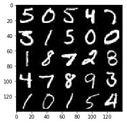
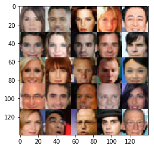

# P4 Face Generation

by Jen-Feng Hsieh

This project will use generative adversarial networks to generate new images of faces.


```python
import os
import hashlib
import zipfile
import gzip
import shutil
import numpy as np
import math
import warnings
import tensorflow as tf

from tqdm import tqdm
from urllib.request import urlretrieve
from glob import glob
from matplotlib import pyplot
from PIL import Image
from distutils.version import LooseVersion

%matplotlib inline
```

### Get the Data
Two datasets are used in this project:
- MNIST
- CelebA

For the first time, we will test the neural network on MNIST before CelebA. Running the GANs on MNIST will see how well the model trains sooner.


```python
class DLProgress(tqdm):
    """
    Handle Progress Bar while Downloading
    """
    last_block = 0

    def hook(self, block_num=1, block_size=1, total_size=None):
        """
        A hook function that will be called once on establishment of the network connection and
        once after each block read thereafter.
        :param block_num: A count of blocks transferred so far
        :param block_size: Block size in bytes
        :param total_size: The total size of the file. This may be -1 on older FTP servers which do not return
                            a file size in response to a retrieval request.
        """
        self.total = total_size
        self.update((block_num - self.last_block) * block_size)
        self.last_block = block_num

        
def _read32(bytestream):
    """
    Read 32-bit integer from bytesteam
    :param bytestream: A bytestream
    :return: 32-bit integer
    """
    dt = np.dtype(np.uint32).newbyteorder('>')
    return np.frombuffer(bytestream.read(4), dtype=dt)[0]


def _unzip(save_path, _, database_name, data_path):
    """
    Unzip wrapper with the same interface as _ungzip
    :param save_path: The path of the gzip files
    :param database_name: Name of database
    :param data_path: Path to extract to
    :param _: HACK - Used to have to same interface as _ungzip
    """
    print('Extracting {}...'.format(database_name))
    with zipfile.ZipFile(save_path) as zf:
        zf.extractall(data_path)

        
def _ungzip(save_path, extract_path, database_name, _):
    """
    Unzip a gzip file and extract it to extract_path
    :param save_path: The path of the gzip files
    :param extract_path: The location to extract the data to
    :param database_name: Name of database
    :param _: HACK - Used to have to same interface as _unzip
    """
    # Get data from save_path
    with open(save_path, 'rb') as f:
        with gzip.GzipFile(fileobj=f) as bytestream:
            magic = _read32(bytestream)
            if magic != 2051:
                raise ValueError('Invalid magic number {} in file: {}'.format(magic, f.name))
            num_images = _read32(bytestream)
            rows = _read32(bytestream)
            cols = _read32(bytestream)
            buf = bytestream.read(rows * cols * num_images)
            data = np.frombuffer(buf, dtype=np.uint8)
            data = data.reshape(num_images, rows, cols)

    # Save data to extract_path
    for image_i, image in enumerate(
            tqdm(data, unit='File', unit_scale=True, miniters=1, desc='Extracting {}'.format(database_name))):
        Image.fromarray(image, 'L').save(os.path.join(extract_path, 'image_{}.jpg'.format(image_i)))

        
def download_extract(database_name, data_path):
    """
    Download and extract database
    :param database_name: Database name
    """
    DATASET_CELEBA_NAME = 'celeba'
    DATASET_MNIST_NAME = 'mnist'

    if database_name == DATASET_CELEBA_NAME:
        url = 'https://s3-us-west-1.amazonaws.com/udacity-dlnfd/datasets/celeba.zip'
        hash_code = '00d2c5bc6d35e252742224ab0c1e8fcb'
        extract_path = os.path.join(data_path, 'img_align_celeba')
        save_path = os.path.join(data_path, 'celeba.zip')
        extract_fn = _unzip
    elif database_name == DATASET_MNIST_NAME:
        url = 'http://yann.lecun.com/exdb/mnist/train-images-idx3-ubyte.gz'
        hash_code = 'f68b3c2dcbeaaa9fbdd348bbdeb94873'
        extract_path = os.path.join(data_path, 'mnist')
        save_path = os.path.join(data_path, 'train-images-idx3-ubyte.gz')
        extract_fn = _ungzip

    if os.path.exists(extract_path):
        print('Found {} Data'.format(database_name))
        return

    if not os.path.exists(data_path):
        os.makedirs(data_path)

    if not os.path.exists(save_path):
        with DLProgress(unit='B', unit_scale=True, miniters=1, desc='Downloading {}'.format(database_name)) as pbar:
            urlretrieve(
                url,
                save_path,
                pbar.hook)

    assert hashlib.md5(open(save_path, 'rb').read()).hexdigest() == hash_code, \
        '{} file is corrupted.  Remove the file and try again.'.format(save_path)

    os.makedirs(extract_path)
    try:
        extract_fn(save_path, extract_path, database_name, data_path)
    except Exception as err:
        shutil.rmtree(extract_path)  # Remove extraction folder if there is an error
        raise err

    # Remove compressed data
    os.remove(save_path)

    
data_dir = './data'
download_extract('mnist', data_dir)
download_extract('celeba', data_dir)
```

    Found mnist Data
    Found celeba Data


## Explore the Data
### MNIST
The [MNIST](http://yann.lecun.com/exdb/mnist/) dataset contains images of handwritten digits.


```python
def get_image(image_path, width, height, mode):
    """
    Read image from image_path
    :param image_path: Path of image
    :param width: Width of image
    :param height: Height of image
    :param mode: Mode of image
    :return: Image data
    """
    image = Image.open(image_path)

    if image.size != (width, height):  # HACK - Check if image is from the CELEBA dataset
        # Remove most pixels that aren't part of a face
        face_width = face_height = 108
        j = (image.size[0] - face_width) // 2
        i = (image.size[1] - face_height) // 2
        image = image.crop([j, i, j + face_width, i + face_height])
        image = image.resize([width, height], Image.BILINEAR)

    return np.array(image.convert(mode))


def get_batch(image_files, width, height, mode):
    data_batch = np.array(
        [get_image(sample_file, width, height, mode) for sample_file in image_files]).astype(np.float32)

    # Make sure the images are in 4 dimensions
    if len(data_batch.shape) < 4:
        data_batch = data_batch.reshape(data_batch.shape + (1,))

    return data_batch


def images_square_grid(images, mode):
    """
    Save images as a square grid
    :param images: Images to be used for the grid
    :param mode: The mode to use for images
    :return: Image of images in a square grid
    """
    # Get maximum size for square grid of images
    save_size = math.floor(np.sqrt(images.shape[0]))

    # Scale to 0-255
    images = (((images - images.min()) * 255) / (images.max() - images.min())).astype(np.uint8)

    # Put images in a square arrangement
    images_in_square = np.reshape(
            images[:save_size*save_size],
            (save_size, save_size, images.shape[1], images.shape[2], images.shape[3]))
    if mode == 'L':
        images_in_square = np.squeeze(images_in_square, 4)

    # Combine images to grid image
    new_im = Image.new(mode, (images.shape[1] * save_size, images.shape[2] * save_size))
    for col_i, col_images in enumerate(images_in_square):
        for image_i, image in enumerate(col_images):
            im = Image.fromarray(image, mode)
            new_im.paste(im, (col_i * images.shape[1], image_i * images.shape[2]))

    return new_im


show_n_images = 25
mnist_images = get_batch(glob(os.path.join(data_dir, 'mnist/*.jpg'))[:show_n_images], 28, 28, 'L')
pyplot.imshow(images_square_grid(mnist_images, 'L'), cmap='gray')
```


    <matplotlib.image.AxesImage at 0x7f5ffa7ab320>





### CelebA
The [CelebFaces Attributes Dataset (CelebA)](http://mmlab.ie.cuhk.edu.hk/projects/CelebA.html) dataset contains over 200,000 celebrity images with annotations.


```python
show_n_images = 25
mnist_images = get_batch(glob(os.path.join(data_dir, 'img_align_celeba/*.jpg'))[:show_n_images], 28, 28, 'RGB')
pyplot.imshow(images_square_grid(mnist_images, 'RGB'))
```


    <matplotlib.image.AxesImage at 0x7f5ffa74d8d0>





## Preprocess the Data
The values of the MNIST and CelebA dataset will be in the range of -0.5 to 0.5 of 28x28 dimensional images.  The CelebA images will be cropped to remove parts of the image that don't include a face, then resized down to 28x28.

The MNIST images are black and white images with a single [color channel](https://en.wikipedia.org/wiki/Channel_(digital_image%29) while the CelebA images have [3 color channels (RGB color channel)](https://en.wikipedia.org/wiki/Channel_(digital_image%29#RGB_Images).
## Build the Neural Network
The GANs will be built by implementing the following functions below:
- `model_inputs`
- `discriminator`
- `generator`
- `model_loss`
- `model_opt`
- `train`

### Check the Version of TensorFlow and Access to GPU
This will check to make sure the version of TensorFlow is correct and a GPU can be accessed.


```python
# Check TensorFlow Version
assert LooseVersion(tf.__version__) >= LooseVersion('1.0'), 'Please use TensorFlow version 1.0 or newer.  You are using {}'.format(tf.__version__)
print('TensorFlow Version: {}'.format(tf.__version__))

# Check for a GPU
if not tf.test.gpu_device_name():
    warnings.warn('No GPU found. Please use a GPU to train your neural network.')
else:
    print('Default GPU Device: {}'.format(tf.test.gpu_device_name()))
```

    TensorFlow Version: 1.0.0
    Default GPU Device: /gpu:0


### Input
Implement the `model_inputs` function to create TF Placeholders for the Neural Network.


```python
def model_inputs(image_width, image_height, image_channels, z_dim):
    """
    Create the model inputs
    :param image_width: The input image width
    :param image_height: The input image height
    :param image_channels: The number of image channels
    :param z_dim: The dimension of Z
    :return: Tuple of (tensor of real input images, tensor of z data, learning rate)
    """
    inputs_real = tf.placeholder(tf.float32, (None, image_width, image_height, image_channels), name='inputs_real')
    inputs_z = tf.placeholder(tf.float32, (None, z_dim), name='inputs_z')
    learning_rate = tf.placeholder(tf.float32, name='learning_rate')
    return (inputs_real, inputs_z, learning_rate)
```

### Discriminator
Implement `discriminator` to create a discriminator neural network that discriminates on `images`.  This function is able to reuse the variables in the neural network using [`tf.variable_scope`](https://www.tensorflow.org/api_docs/python/tf/variable_scope) with a scope name of "discriminator".


```python
def discriminator(images, reuse = False, alpha = 0.2):
    """
    Create the discriminator network
    :param images: Tensor of input image(s)
    :param reuse: Boolean if the weights should be reused
    :return: Tuple of (tensor output of the discriminator, tensor logits of the discriminator)
    """
    with tf.variable_scope('discriminator', reuse=reuse):
        # Input layer is 28x28x3
        x1 = tf.layers.conv2d(images, 64, 5, strides = 2, padding = 'same')
        relu1 = tf.maximum(alpha * x1, x1)
        # 14 x 14 x 64

        x2 = tf.layers.conv2d(relu1, 128, 5, strides = 2, padding = 'same')
        bn2 = tf.layers.batch_normalization(x2, training = True)
        relu2 = tf.maximum(alpha * bn2, bn2)
        # 7 x 7 x 128

        x3 = tf.layers.conv2d(relu2, 256, 5, strides = 2, padding = 'same')
        bn3 = tf.layers.batch_normalization(x3, training = True)
        relu3 = tf.maximum(alpha * bn3, bn3)
        # 4 x 4 x 256

        # Flatten it
        flat = tf.reshape(relu3, (-1, 4 * 4 * 256))
        logits = tf.layers.dense(flat, 1)
        out = tf.sigmoid(logits)

        return (out, logits)
```

### Generator
Implement `generator` to generate an image using `z`. This function is able to reuse the variables in the neural network using [`tf.variable_scope`](https://www.tensorflow.org/api_docs/python/tf/variable_scope) with a scope name of "generator". The function will return the generated 28 x 28 x `out_channel_dim` images.


```python
def generator(z, out_channel_dim, is_train = True, alpha = 0.2):
    """
    Create the generator network
    :param z: Input z
    :param out_channel_dim: The number of channels in the output image
    :param is_train: Boolean if generator is being used for training
    :return: The tensor output of the generator
    """
    with tf.variable_scope('generator', reuse = not is_train):
        # First fully connected layer
        x1 = tf.layers.dense(z, 4 * 4 * 512)
        # Reshape it to start the convolutional stack
        x1 = tf.reshape(x1, (-1, 4, 4, 512))
        x1 = tf.layers.batch_normalization(x1, training = is_train)
        x1 = tf.maximum(alpha * x1, x1)
        # 4 x 4 x 512
        
        x2 = tf.layers.conv2d_transpose(x1, 256, 4, strides = 1, padding = 'valid')
        x2 = tf.layers.batch_normalization(x2, training = is_train)
        x2 = tf.maximum(alpha * x2, x2)
        # 7 x 7 x 256
        
        x3 = tf.layers.conv2d_transpose(x2, 128, 5, strides = 2, padding = 'same')
        x3 = tf.layers.batch_normalization(x3, training = is_train)
        x3 = tf.maximum(alpha * x3, x3)
        # 14 x 14 x 128
        
        # Output layer
        logits = tf.layers.conv2d_transpose(x3, out_channel_dim, 5, strides = 2, padding = 'same')
        # 28 x 28 x 3
        
        out = tf.tanh(logits)
        
        return out
```

### Loss
Implement `model_loss` to build the GANs for training and calculate the loss.


```python
def model_loss(input_real, input_z, out_channel_dim, alpha = 0.2):
    """
    Get the loss for the discriminator and generator
    :param input_real: Images from the real dataset
    :param input_z: Z input
    :param out_channel_dim: The number of channels in the output image
    :return: A tuple of (discriminator loss, generator loss)
    """
    g_model = generator(input_z, out_channel_dim, is_train = True, alpha = alpha)
    d_model_real, d_logits_real = discriminator(input_real, alpha = alpha)
    d_model_fake, d_logits_fake = discriminator(g_model, reuse = True, alpha = alpha)

    d_loss_real = tf.reduce_mean(
        tf.nn.sigmoid_cross_entropy_with_logits(logits=d_logits_real, labels=tf.ones_like(d_model_real)))
    d_loss_fake = tf.reduce_mean(
        tf.nn.sigmoid_cross_entropy_with_logits(logits=d_logits_fake, labels=tf.zeros_like(d_model_fake)))
    g_loss = tf.reduce_mean(
        tf.nn.sigmoid_cross_entropy_with_logits(logits=d_logits_fake, labels=tf.ones_like(d_model_fake)))

    d_loss = d_loss_real + d_loss_fake

    return (d_loss, g_loss)
```

### Optimization
Implement `model_opt` to create the optimization operations for the GANs. Use [`tf.trainable_variables`](https://www.tensorflow.org/api_docs/python/tf/trainable_variables) to get all the trainable variables and filter the variables with names that are in the discriminator and generator scope names.


```python
def model_opt(d_loss, g_loss, learning_rate, beta1):
    """
    Get optimization operations
    :param d_loss: Discriminator loss Tensor
    :param g_loss: Generator loss Tensor
    :param learning_rate: Learning Rate Placeholder
    :param beta1: The exponential decay rate for the 1st moment in the optimizer
    :return: A tuple of (discriminator training operation, generator training operation)
    """
    # Get weights and bias to update
    t_vars = tf.trainable_variables()
    d_vars = [var for var in t_vars if var.name.startswith('discriminator')]
    g_vars = [var for var in t_vars if var.name.startswith('generator')]

    # Optimize
    with tf.control_dependencies(tf.get_collection(tf.GraphKeys.UPDATE_OPS)):
        d_train_opt = tf.train.AdamOptimizer(learning_rate, beta1 = beta1).minimize(d_loss, var_list = d_vars)
        g_train_opt = tf.train.AdamOptimizer(learning_rate, beta1 = beta1).minimize(g_loss, var_list = g_vars)

    return (d_train_opt, g_train_opt)
```

## Neural Network Training
### Show Output
Use this function to show the current output of the generator during training. It will help to determine how well the GANs is training.


```python
def images_square_grid(images, mode):
    """
    Save images as a square grid
    :param images: Images to be used for the grid
    :param mode: The mode to use for images
    :return: Image of images in a square grid
    """
    # Get maximum size for square grid of images
    save_size = math.floor(np.sqrt(images.shape[0]))

    # Scale to 0-255
    images = (((images - images.min()) * 255) / (images.max() - images.min())).astype(np.uint8)

    # Put images in a square arrangement
    images_in_square = np.reshape(
            images[:save_size*save_size],
            (save_size, save_size, images.shape[1], images.shape[2], images.shape[3]))
    if mode == 'L':
        images_in_square = np.squeeze(images_in_square, 4)

    # Combine images to grid image
    new_im = Image.new(mode, (images.shape[1] * save_size, images.shape[2] * save_size))
    for col_i, col_images in enumerate(images_in_square):
        for image_i, image in enumerate(col_images):
            im = Image.fromarray(image, mode)
            new_im.paste(im, (col_i * images.shape[1], image_i * images.shape[2]))

    return new_im


def show_generator_output(sess, n_images, input_z, out_channel_dim, image_mode):
    """
    Show example output for the generator
    :param sess: TensorFlow session
    :param n_images: Number of Images to display
    :param input_z: Input Z Tensor
    :param out_channel_dim: The number of channels in the output image
    :param image_mode: The mode to use for images ("RGB" or "L")
    """
    cmap = None if image_mode == 'RGB' else 'gray'
    z_dim = input_z.get_shape().as_list()[-1]
    example_z = np.random.uniform(-1, 1, size=[n_images, z_dim])

    samples = sess.run(
        generator(input_z, out_channel_dim, False),
        feed_dict={input_z: example_z})

    images_grid = images_square_grid(samples, image_mode)
    pyplot.imshow(images_grid, cmap=cmap)
    pyplot.show()
```

### Train
Implement `train` to build and train the GANs.
Use the `show_generator_output` to show `generator` output while training, and print the `generator` output every 100 batches.


```python
def train(epoch_count, batch_size, z_dim, learning_rate, beta1, get_batches, data_shape, data_image_mode, 
          alpha = 0.2, print_every = 50, show_every = 500, n_images = show_n_images):
    """
    Train the GAN
    :param epoch_count: Number of epochs
    :param batch_size: Batch Size
    :param z_dim: Z dimension
    :param learning_rate: Learning Rate
    :param beta1: The exponential decay rate for the 1st moment in the optimizer
    :param get_batches: Function to get batches
    :param data_shape: Shape of the data
    :param data_image_mode: The image mode to use for images ("RGB" or "L")
    """    
    out_channel_dim = data_shape[3]
    
    inputs_real, inputs_z, t_learning_rate = model_inputs(data_shape[1], data_shape[2], data_shape[3], z_dim)
    d_loss, g_loss = model_loss(inputs_real, inputs_z, out_channel_dim, alpha = alpha)
    d_train_opt, g_train_opt = model_opt(d_loss, g_loss, t_learning_rate, beta1)
    
    steps = 0
    
    with tf.Session() as sess:
        sess.run(tf.global_variables_initializer())
        for epoch_i in range(epoch_count):
            for batch_images in get_batches(batch_size):
                
                steps += 1
                
                # Change the range of -0.5 to 0.5 of 28x28 dimensional images to the range of -1 to 1
                batch_images *= 2
                
                # Sample random noise for G
                batch_z = np.random.uniform(-1, 1, size = (batch_size, z_dim))
                
                # Run optimizers
                _ = sess.run(d_train_opt, feed_dict = {inputs_real: batch_images, inputs_z: batch_z, 
                                                      t_learning_rate: learning_rate})
                _ = sess.run(g_train_opt, feed_dict = {inputs_real: batch_images, inputs_z: batch_z, 
                                                      t_learning_rate: learning_rate})
                
                if steps % print_every == 0:
                    # At the end of each epoch, get the losses and print them out
                    train_loss_d = d_loss.eval({inputs_real: batch_images, inputs_z: batch_z})
                    train_loss_g = g_loss.eval({inputs_z: batch_z})

                    print ("Epoch {}/{}...".format(epoch_i + 1, epoch_count), 
                           "Discriminator Loss: {:.4f}...".format(train_loss_d), 
                           "Generator Loss: {:.4f}".format(train_loss_g))

                if steps % show_every == 0:
                    show_generator_output(sess, n_images, inputs_z, out_channel_dim, data_image_mode)


class Dataset(object):
    """
    Dataset
    """
    def __init__(self, dataset_name, data_files):
        """
        Initalize the class
        :param dataset_name: Database name
        :param data_files: List of files in the database
        """
        DATASET_CELEBA_NAME = 'celeba'
        DATASET_MNIST_NAME = 'mnist'
        IMAGE_WIDTH = 28
        IMAGE_HEIGHT = 28

        if dataset_name == DATASET_CELEBA_NAME:
            self.image_mode = 'RGB'
            image_channels = 3

        elif dataset_name == DATASET_MNIST_NAME:
            self.image_mode = 'L'
            image_channels = 1

        self.data_files = data_files
        self.shape = len(data_files), IMAGE_WIDTH, IMAGE_HEIGHT, image_channels

    def get_batches(self, batch_size):
        """
        Generate batches
        :param batch_size: Batch Size
        :return: Batches of data
        """
        IMAGE_MAX_VALUE = 255

        current_index = 0
        while current_index + batch_size <= self.shape[0]:
            data_batch = get_batch(
                self.data_files[current_index:current_index + batch_size],
                *self.shape[1:3],
                self.image_mode)

            current_index += batch_size

            yield data_batch / IMAGE_MAX_VALUE - 0.5
```

### MNIST
Test the GANs architecture on MNIST.  After 2 epochs, the GANs is able to generate images that look like handwritten digits.


```python
batch_size = 64
z_dim = 200
learning_rate = 0.0002
beta1 = 0.5

epochs = 2

mnist_dataset = Dataset('mnist', glob(os.path.join(data_dir, 'mnist/*.jpg')))
with tf.Graph().as_default():
    train(epochs, batch_size, z_dim, learning_rate, beta1, mnist_dataset.get_batches,
          mnist_dataset.shape, mnist_dataset.image_mode)
```

    Epoch 1/2... Discriminator Loss: 0.9508... Generator Loss: 10.5805
    Epoch 1/2... Discriminator Loss: 0.1292... Generator Loss: 3.9269
    Epoch 1/2... Discriminator Loss: 0.1883... Generator Loss: 2.8662
    Epoch 1/2... Discriminator Loss: 0.8475... Generator Loss: 3.7699
    Epoch 1/2... Discriminator Loss: 0.6352... Generator Loss: 1.6750
    Epoch 1/2... Discriminator Loss: 1.1501... Generator Loss: 0.7429
    Epoch 1/2... Discriminator Loss: 1.0035... Generator Loss: 0.6312
    Epoch 1/2... Discriminator Loss: 0.7585... Generator Loss: 1.6897
    Epoch 1/2... Discriminator Loss: 1.1431... Generator Loss: 0.5807
    Epoch 1/2... Discriminator Loss: 1.0103... Generator Loss: 0.6678


    Epoch 1/2... Discriminator Loss: 0.8120... Generator Loss: 0.9998
    Epoch 1/2... Discriminator Loss: 0.9855... Generator Loss: 1.2267
    Epoch 1/2... Discriminator Loss: 1.2381... Generator Loss: 2.3853
    Epoch 1/2... Discriminator Loss: 0.7104... Generator Loss: 1.5223
    Epoch 1/2... Discriminator Loss: 0.9383... Generator Loss: 0.8531
    Epoch 1/2... Discriminator Loss: 1.2550... Generator Loss: 0.4751
    Epoch 1/2... Discriminator Loss: 1.2844... Generator Loss: 0.4691
    Epoch 1/2... Discriminator Loss: 0.6810... Generator Loss: 1.3898
    Epoch 2/2... Discriminator Loss: 0.7894... Generator Loss: 1.3265
    Epoch 2/2... Discriminator Loss: 1.3993... Generator Loss: 0.3484


    Epoch 2/2... Discriminator Loss: 0.7745... Generator Loss: 1.0981
    Epoch 2/2... Discriminator Loss: 0.8553... Generator Loss: 0.8511
    Epoch 2/2... Discriminator Loss: 1.0440... Generator Loss: 0.6130
    Epoch 2/2... Discriminator Loss: 0.6586... Generator Loss: 1.2254
    Epoch 2/2... Discriminator Loss: 0.7599... Generator Loss: 0.9799
    Epoch 2/2... Discriminator Loss: 0.8696... Generator Loss: 0.8969
    Epoch 2/2... Discriminator Loss: 0.5900... Generator Loss: 1.1246
    Epoch 2/2... Discriminator Loss: 1.6642... Generator Loss: 0.2851
    Epoch 2/2... Discriminator Loss: 0.6548... Generator Loss: 1.2074
    Epoch 2/2... Discriminator Loss: 1.5247... Generator Loss: 2.6095


    Epoch 2/2... Discriminator Loss: 0.5480... Generator Loss: 1.2901
    Epoch 2/2... Discriminator Loss: 1.1480... Generator Loss: 0.5298
    Epoch 2/2... Discriminator Loss: 1.1222... Generator Loss: 1.8012
    Epoch 2/2... Discriminator Loss: 0.4543... Generator Loss: 1.5182
    Epoch 2/2... Discriminator Loss: 0.4495... Generator Loss: 1.6886
    Epoch 2/2... Discriminator Loss: 0.5732... Generator Loss: 1.4057
    Epoch 2/2... Discriminator Loss: 0.8877... Generator Loss: 0.7678


### CelebA
Run GANs on CelebA.


```python
batch_size = 64
z_dim = 200
learning_rate = 0.0002
beta1 = 0.5

epochs = 1

celeba_dataset = Dataset('celeba', glob(os.path.join(data_dir, 'img_align_celeba/*.jpg')))
with tf.Graph().as_default():
    train(epochs, batch_size, z_dim, learning_rate, beta1, celeba_dataset.get_batches,
          celeba_dataset.shape, celeba_dataset.image_mode)
```

    Epoch 1/1... Discriminator Loss: 0.3583... Generator Loss: 10.9578
    Epoch 1/1... Discriminator Loss: 0.7201... Generator Loss: 0.8973
    Epoch 1/1... Discriminator Loss: 0.2617... Generator Loss: 2.3367
    Epoch 1/1... Discriminator Loss: 0.1700... Generator Loss: 2.7673
    Epoch 1/1... Discriminator Loss: 0.1439... Generator Loss: 2.6388
    Epoch 1/1... Discriminator Loss: 0.4975... Generator Loss: 2.0121
    Epoch 1/1... Discriminator Loss: 0.4257... Generator Loss: 1.9195
    Epoch 1/1... Discriminator Loss: 0.3630... Generator Loss: 2.5318
    Epoch 1/1... Discriminator Loss: 0.3456... Generator Loss: 2.2768
    Epoch 1/1... Discriminator Loss: 0.7360... Generator Loss: 0.9883


    Epoch 1/1... Discriminator Loss: 0.5400... Generator Loss: 2.0253
    Epoch 1/1... Discriminator Loss: 0.6256... Generator Loss: 1.2995
    Epoch 1/1... Discriminator Loss: 0.7087... Generator Loss: 1.3199
    Epoch 1/1... Discriminator Loss: 0.7795... Generator Loss: 1.1810
    Epoch 1/1... Discriminator Loss: 0.6588... Generator Loss: 1.5333
    Epoch 1/1... Discriminator Loss: 0.9135... Generator Loss: 0.7933
    Epoch 1/1... Discriminator Loss: 0.5814... Generator Loss: 1.4132
    Epoch 1/1... Discriminator Loss: 0.7032... Generator Loss: 1.2387
    Epoch 1/1... Discriminator Loss: 1.4382... Generator Loss: 4.1986
    Epoch 1/1... Discriminator Loss: 0.8136... Generator Loss: 1.2367


    Epoch 1/1... Discriminator Loss: 1.5099... Generator Loss: 0.5376
    Epoch 1/1... Discriminator Loss: 1.3859... Generator Loss: 0.4725
    Epoch 1/1... Discriminator Loss: 1.3060... Generator Loss: 0.6226
    Epoch 1/1... Discriminator Loss: 0.7992... Generator Loss: 1.4063
    Epoch 1/1... Discriminator Loss: 1.0286... Generator Loss: 0.7687
    Epoch 1/1... Discriminator Loss: 0.9816... Generator Loss: 0.9058
    Epoch 1/1... Discriminator Loss: 1.1768... Generator Loss: 0.6455
    Epoch 1/1... Discriminator Loss: 1.0847... Generator Loss: 1.2240
    Epoch 1/1... Discriminator Loss: 1.1439... Generator Loss: 0.5822
    Epoch 1/1... Discriminator Loss: 0.9869... Generator Loss: 1.1085


    Epoch 1/1... Discriminator Loss: 1.0718... Generator Loss: 0.6514
    Epoch 1/1... Discriminator Loss: 1.0861... Generator Loss: 1.1488
    Epoch 1/1... Discriminator Loss: 0.8885... Generator Loss: 1.2153
    Epoch 1/1... Discriminator Loss: 0.9988... Generator Loss: 1.6858
    Epoch 1/1... Discriminator Loss: 1.0310... Generator Loss: 1.1229
    Epoch 1/1... Discriminator Loss: 0.9954... Generator Loss: 0.7418
    Epoch 1/1... Discriminator Loss: 1.0133... Generator Loss: 2.0079
    Epoch 1/1... Discriminator Loss: 0.8755... Generator Loss: 0.8928
    Epoch 1/1... Discriminator Loss: 1.2376... Generator Loss: 0.6428
    Epoch 1/1... Discriminator Loss: 1.2682... Generator Loss: 0.4814


    Epoch 1/1... Discriminator Loss: 1.0211... Generator Loss: 0.9828
    Epoch 1/1... Discriminator Loss: 1.3320... Generator Loss: 0.3913
    Epoch 1/1... Discriminator Loss: 0.8577... Generator Loss: 1.4012
    Epoch 1/1... Discriminator Loss: 0.8098... Generator Loss: 1.2952
    Epoch 1/1... Discriminator Loss: 1.2576... Generator Loss: 0.5112
    Epoch 1/1... Discriminator Loss: 1.6450... Generator Loss: 0.2905
    Epoch 1/1... Discriminator Loss: 0.7629... Generator Loss: 1.1225
    Epoch 1/1... Discriminator Loss: 0.7124... Generator Loss: 1.5812
    Epoch 1/1... Discriminator Loss: 1.0008... Generator Loss: 0.8057
    Epoch 1/1... Discriminator Loss: 1.0140... Generator Loss: 0.6878


    Epoch 1/1... Discriminator Loss: 0.6499... Generator Loss: 1.3869
    Epoch 1/1... Discriminator Loss: 0.7504... Generator Loss: 0.9518
    Epoch 1/1... Discriminator Loss: 1.0480... Generator Loss: 0.9521
    Epoch 1/1... Discriminator Loss: 0.9210... Generator Loss: 1.5734
    Epoch 1/1... Discriminator Loss: 1.3728... Generator Loss: 0.5217
    Epoch 1/1... Discriminator Loss: 0.9392... Generator Loss: 1.0064
    Epoch 1/1... Discriminator Loss: 1.3005... Generator Loss: 0.5178
    Epoch 1/1... Discriminator Loss: 1.0633... Generator Loss: 1.6731
    Epoch 1/1... Discriminator Loss: 0.9292... Generator Loss: 1.6836
    Epoch 1/1... Discriminator Loss: 1.3804... Generator Loss: 0.3751


    Epoch 1/1... Discriminator Loss: 1.3406... Generator Loss: 0.8755
    Epoch 1/1... Discriminator Loss: 0.8622... Generator Loss: 1.2167
    Epoch 1/1... Discriminator Loss: 1.0292... Generator Loss: 0.8027

